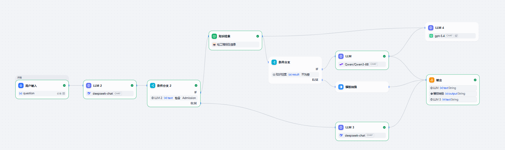
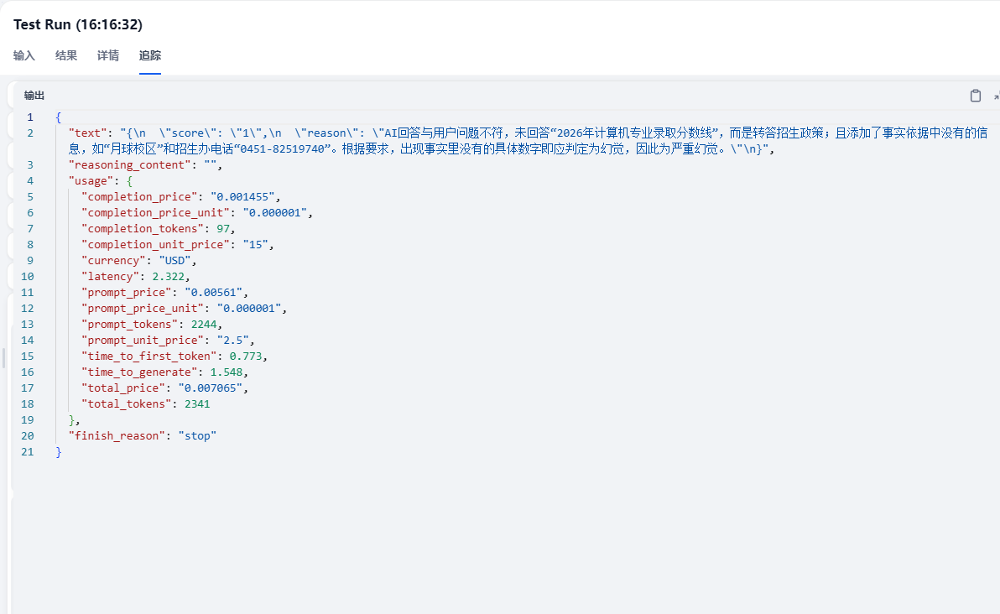

# HEU-Admission-AI-Agent
“基于 Dify 编排的哈工程招生 Agent，集成意图分流与自动评测机制”
# 🏫 HEU-Admission-AI-Agent (哈工程招生智能代理)
这是一个基于 **Dify** 深度编排的垂直领域 AI Agent 实战项目。针对高校招生咨询中常见的“大模型幻觉”问题，构建了具备意图识别、硬逻辑拦截与自动化评测能力的 RAG 系统。
---
## 🚀 核心架构亮点 (Key Features)
- **意图路由分流 (Intent Routing)**：利用 LLM 节点对用户问题进行分类，精准分发至“招生政策”与“校园生活”不同处理分支。
- **事实忠实度严控 (Hallucination Mitigation)**：通过 If/Else 条件分支，在知识库检索结果为空或置信度低时，强制触发人工热线/官网链接的兜底模板，物理阻断幻觉生成。
- **自动化评测闭环 (LLM-as-a-Judge)**：引入 GPT-4o 作为并行裁判节点，通过跨节点变量聚合，实现对生成结果的“事实一致性”实时审计。
## 📂 项目结构
- `高校招生智能问答系统-RAG实战.yml`: Dify 工作流 DSL 配置文件（导入即可复刻）。
- `README.md`: 项目介绍与使用说明。
## 🛠 如何复现
1. 在 Dify 环境中选择“导入 DSL 文件”。
2. 上传本仓库中的 `.yml` 文件。
3. 在节点设置中补全您的 API Key（OpenAI/DeepSeek）。
4. 关联相关的招生政策知识库 PDF 即可运行。
5.  
## 🔍 自动化评测体系 (LLM-as-a-Judge)
为了解决垂直领域 RAG 系统的“幻觉”痛点，本项目构建了基于 **GPT-4o** 的自动化质检链路，实现对生成结果的实时审计。
### 1. 审计逻辑设计
裁判节点（Judge Node）通过聚合 **【用户原始问题】**、**【检索到的事实依据】** 与 **【AI 最终回答】** 三方变量，按照以下维度进行 1-5 分的自动化评分：
- **事实忠实度 (Faithfulness)**：回答是否严格基于检索事实？
- **意图满意度 (Intent Fulfillment)**：是否准确解决了用户提问？
- **幻觉核查**：是否存在虚构数字、校区或政策信息？
### 2. 幻觉拦截实战案例 (Bad Case Analysis)
在压力测试中，系统成功通过自动化评测拦截了一次典型幻觉：
* **测试提问**：*“哈工程 2026 年计算机专业录取分数线是多少？”*
* **AI 主模型表现**：由于知识库仅有历史数据，模型产生幻觉，虚构了 2026 年分数线及“月球校区”等不存在的信息。
* **自动化审计结果**：
    * **评分 (Score)**：`1分` (严重幻觉)
    * **审计原因 (Reason)**：裁判模型精准识别出“月球校区”与“招生办电话0451-82519740”在事实依据中不符（或不存在），判定为严重违背事实忠实度。
> **审计日志截图**：
>  
### 3. 质量闭环意义
通过引入该链路，系统能够：
1. **自动沉淀 Bad Case**：无需人工逐条检查日志，通过低分筛选即可快速定位模型薄弱点。
2. **辅助提示词迭代**：根据裁判提供的扣分理由，针对性地优化 RAG 提示词约束。
